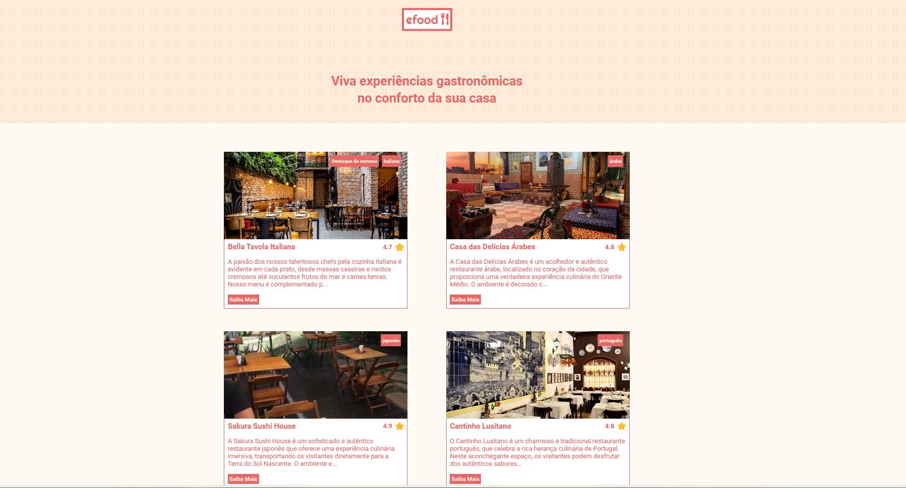

<h1>Descrição do projeto:</h1>
Projeto desenvolvido com React. Foi desenvolvida uma landing page com diversos restaurantes e opções de pratos prontos "efood". Clicando no botão "carrinho" o produto é inserido no carrinho de compras da página e os valores são somadas automaticamente, conforme mais produtos são acrescentados e assim que finalizado a compra o usuário é redirecionando para um campo de preenchimento de dados para entrega e pagamento. Na página home são apresentados todos os restaurantes e suas respectivas especialidades, cada restaurante possui sua página e seu respectivo cardápio. No rodapé da página estão disponíveis minhas redes sociais, clicando no respectivo ícone. Para esse projeto foi utilizado a biblioteca Redux de gerenciamento de estado para aplicativos JavaScript, sendo usado em conjunto com o React. React Testing Library também foi utilizado sendo uma biblioteca de testes para React que visa facilitar a escrita de testes de componentes de forma mais natural e eficiente.

<h2>
    Pré-visualização
 </h2>

<h1>Visualização Online</h1>
A landing page do projeto está disponível para visualização na Vercel. Você pode acessá-la através do seguinte link:
Página com informações do Github: https://efood-eta.vercel.app/

## Skills utilizadas:

 
  
  
  
  
  
  
   
